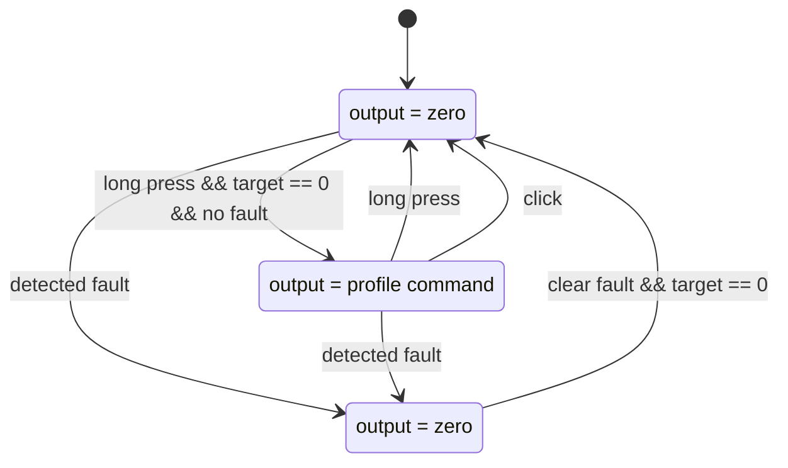

# Safety State Machine

```mermaid
stateDiagram-v2
    [*] --> Disabled

    Disabled --> Armed: long press && target == 0 && no fault
    Armed --> Disabled: long press
    Armed --> Disabled: click
    Disabled --> Fault: detected fault
    Armed --> Fault: detected fault
    Fault --> Disabled: clear fault && target == 0

    Disabled: output = zero
    Armed: output = profile command
    Fault: output = zero
```
