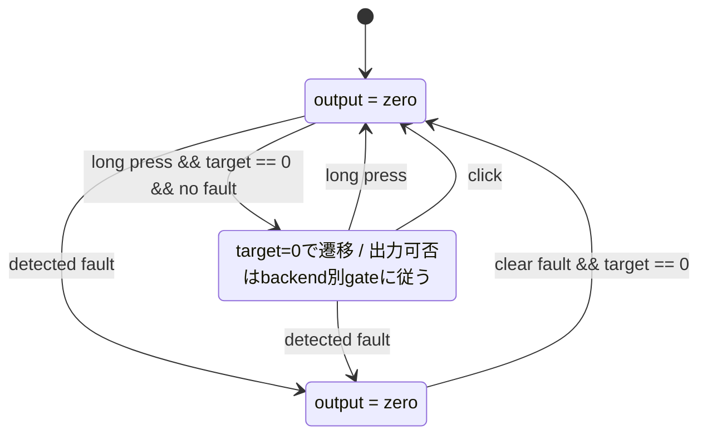

# Safety State Machine

> [!WARNING]
> `Armed` 状態の出力扱いはバックエンドによって異なる。
> 既存のPWM/GPIOバックエンドでは `Armed` 中のプロファイルコマンド出力が許可されるが、DDモータ等の初期bring-upにおいて、`Armed` は non-zero command 許可状態ではない。
> DDモータ制御では、明示的な操作による `OutputEnabled` または `Active` 状態を `Armed` の先に新設し、non-zero command はその状態でのみ許可すべきである。
